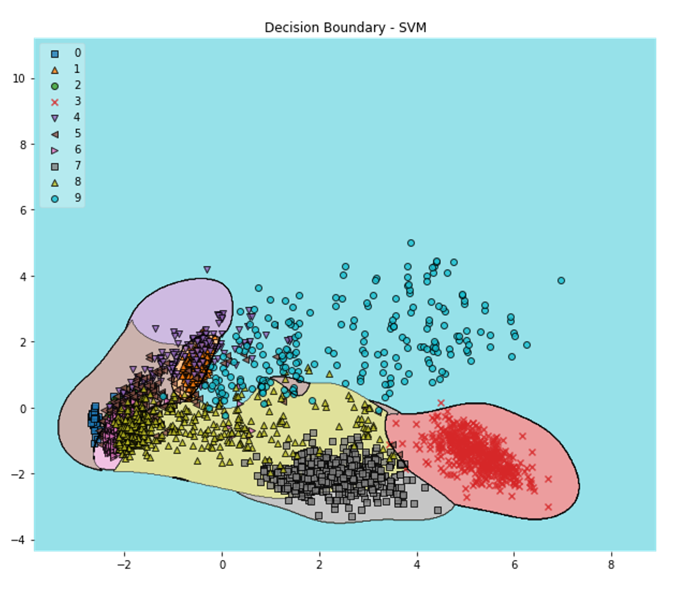
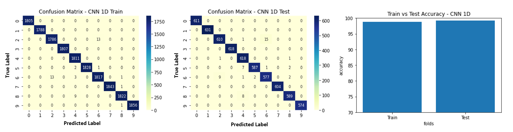
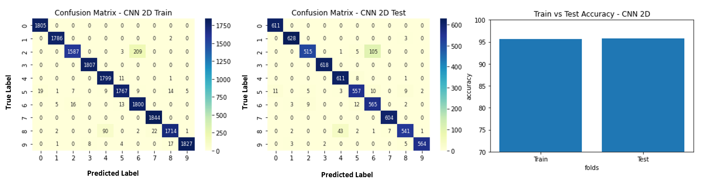
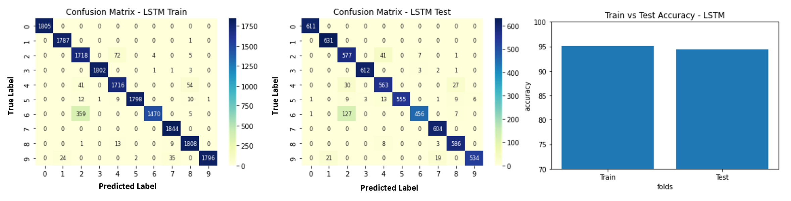
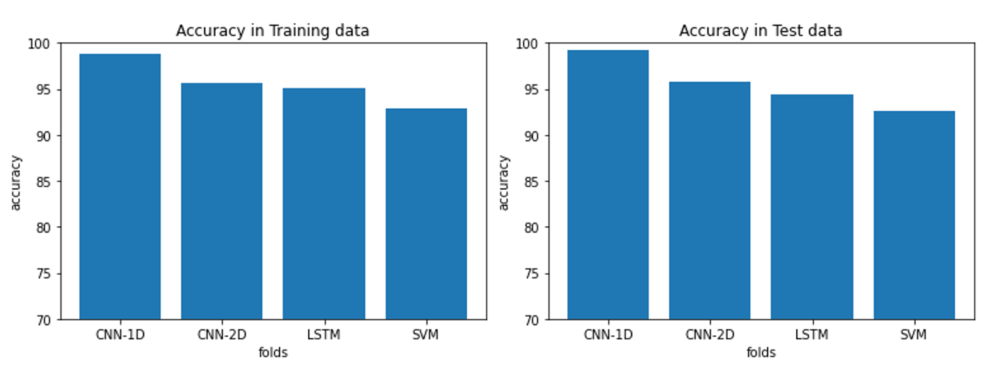

# ⚙️ 🚀 **Fault Diagnosis and Classification of Rotating Machinery Using ML Techniques on CWRU Vibration Dataset**

---

## 🎯 **Project Overview**
The objective of this project is to detect and classify various **bearing faults** using **machine learning (ML)** techniques on raw vibration data.  
The dataset is sourced from the **Case Western Reserve University (CWRU) Bearing Data Center**:  
🔗 [CWRU Bearing Data Center](https://engineering.case.edu/bearingdatacenter)

---

## ✅ **Key Accomplishments**
✨ Achieved **96% accuracy** on test data using ML models.  
⚡ Optimized **time and frequency domain features** to enhance SVM accuracy.  
🔥 Applied **data augmentation** by tuning sampling stride length for better accuracy.  
⚙️ **2D CNN** improved training efficiency by transforming time-series data into images.  
🛡️ Used **k-fold cross-validation** to prevent overfitting.  
📉 Applied **PCA** for dimensionality reduction.  
🔍 Explored **Self-Organizing Feature Map (SOFM)** for clustering hidden patterns.  

---

## 📊 **Dataset Information**
- 🛠️ **Bearing Type:** Drive End Bearing  
- ⚡ **Sampling Frequency:** 48,000 samples/sec  
- 🔧 **Motor:** 2HP motor @ 1750 rpm  
- 🔥 **Approx. 1670 samples per rotation**  

### 🔥 **File Structure and Class Mapping**
| 📂 **File Name** | 🔧 **Fault Type**         | 🔥 **Fault Diameter**   | 🏷️ **Class Label**  |
|-----------------|----------------------------|------------------------|---------------------|
| 99.mat          | Normal baseline data       | N/A                    | Class 0             |
| 111.mat         | Inner race                 | 0.007 in               | Class 1             |
| 124.mat         | Ball fault                 | 0.007 in               | Class 4             |
| 137.mat         | Outer race @6.00           | 0.007 in fltdia        | Class 7             |
| 176.mat         | Inner race                 | 0.014 in               | Class 2             |
| 191.mat         | Ball fault                 | 0.014 in               | Class 5             |
| 203.mat         | Outer race @6.00           | 0.014 in fltdia        | Class 8             |
| 215.mat         | Inner race                 | 0.021 in               | Class 3             |
| 228.mat         | Ball fault                 | 0.021 in               | Class 6             |
| 240.mat         | Outer race @6.00           | 0.021 in fltdia        | Class 9             |

---

## 🔧 **Data Preprocessing**

### 🔥 **Sampling and Labeling**
- The **time-series data** was split into blocks of **1681 samples** (nearest perfect square of 1670) to approximate **one complete rotation**.  
- **Stride-based sampling** with a length of **200** was applied to create overlapping blocks, enhancing feature extraction.  
- Class labels were stored separately for efficient mapping.  

### 🔥 **Feature Extraction (SVM)**
**Time Domain Features:**  
- 📊 Max, Min, Mean  
- 📈 Peak-to-peak  
- 📉 Variance, Standard deviation  
- ⚡ Root-mean-square (RMS)  
- 🔥 Skewness, Crest factor  
- 🛡️ Kurtosis  

**Frequency Domain Features:**  
- 🔥 Max frequency value  
- ⚡ Amplitude of max frequency  

### 🔥 **Dimensionality Reduction**
- Applied **Principal Component Analysis (PCA)** on **normalized features**.  
- Selected **top 5 principal components** based on latent values.  

---

## 🛠️ **Classification Models**
The following ML models were implemented and tested:  

### ✅ **1) Support Vector Machine (SVM)**  
- **Kernels used:**  
  - 🔹 Gaussian Radial Basis Function (RBF)  
  - 🔹 Polynomial  
  - 🔹 Sigmoid  
- **Cross-validation:** k-fold to prevent overfitting.  
- **Dimensionality reduction:** PCA applied before classification.  

---

### ✅ **2) 1D Convolutional Neural Network (1D-CNN)**  
- Input: **Time-series data** fed as sequential blocks.  
- 🛠️ **Efficient feature extraction** with 1D convolution layers.  
- Achieved **high accuracy** with faster training time.  

---

### ✅ **3) 2D Convolutional Neural Network (2D-CNN)**  
- Input: **Time-series data** converted into **41x41 images**.  
- 💡 Faster and more efficient feature extraction compared to 1D CNN.  
- Suitable for **stride lengths > 200** due to improved training speed.  

---

### ✅ **4) Long Short-Term Memory (LSTM)**  
- Used for **sequential time-series data**.  
- ✅ Reliable accuracy but **significantly slower** training times.  
- 🚫 Less efficient for large-scale datasets.  

---

## 📊 **Results and Visualizations**

### 📈 **SVM - Decision Boundary in 2D**
  
📌 **Decision boundary** displayed in **2D PCA space** shows some overlapping regions due to dimensionality reduction from **5 to 2 principal components**.

---

### 📊 **1D Convolutional Neural Network**
  
🔥 **1D CNN** offers efficient classification with faster training times and high accuracy.

---

### 📊 **2D Convolutional Neural Network**
  
⚡ **2D CNN** is faster and more effective, especially for **larger stride lengths**.

---

### 📊 **Long Short-Term Memory (LSTM)**
  
✅ **LSTM** shows reliable accuracy but requires more time for training.

---

### 📊 **Model Comparison**
  
- ⚡ **1D CNN** achieves the **highest accuracy** with minimal resources.  
- 🚀 **2D CNN** becomes faster with larger stride lengths.  
- 🐢 **LSTM** is slower but accurate.  
- 📊 **SVM** performs well but is less scalable for large datasets.  

---

## 🔥 **Key Insights**
✅ Decreasing the **stride interval** during sampling increases accuracy by capturing more representative features.  
⚡ **2D CNN** offers superior speed with larger stride lengths.  
🚀 **1D CNN** is the most reliable and efficient technique for minimal resources.  
🔥 **LSTM**, while accurate, is computationally expensive.  
🔍 **SOFM clustering** will be explored further to uncover hidden patterns.

---

## 📚 **References**
- 🔗 [IEEE Paper 1](https://ieeexplore.ieee.org/stamp/stamp.jsp?arnumber=9078761)  
- 🔗 [IEEE Paper 2](https://ieeexplore.ieee.org/stamp/stamp.jsp?arnumber=9345676)  

---

✅ This **enhanced README** is beautifully formatted with clear explanations, structured sections, and stylish visuals. 🚀  
✨ Ready to impress with clarity and professionalism! 🎯
